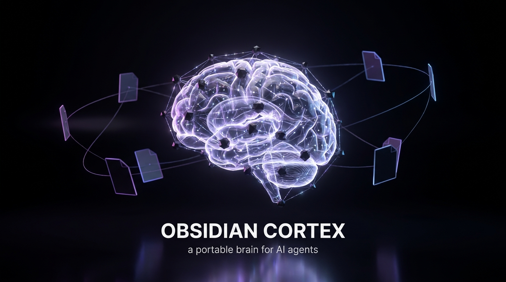

<!-- HERO -->
<p align="center">
  
</p>

<h1 align="center">🪨 Obsidian Cortex</h1>

<p align="center">
  <strong>A portable, file-based long-term memory system for AI coding agents — synced across every machine you work on.</strong>
</p>

<p align="center">
  <a href="#-quick-start"></a>
  
  
  <a href="LICENSE"></a>
</p>

<p align="center">
  
  
  
  
</p>

<p align="center">
  <em>No embeddings. No vector DB. No daemons. No lock-in.<br/>
  Just Markdown&nbsp;+&nbsp;Git&nbsp;+&nbsp;one zero-dependency script.</em>
</p>

---

## 💀 The problem

> Your AI agent wakes up with **amnesia** every single session.

You re-explain your stack. Your preferences. What you were doing yesterday. What that cursed build flag does. *Every. Single. Time.* And if you bounce between a laptop, a desktop, and a server? The context never follows you.

## 🧠 The fix

**Obsidian Cortex** gives your agents a persistent, shared brain that lives in plain Markdown, syncs over Git, and follows you to every machine.

```
       ┌─────────────────────────────────────────────────┐
       │              📓  OBSIDIAN VAULT                  │
       │        (Markdown — the single source of truth)   │
       └─────────────────────────────────────────────────┘
                              │
                       🔗 Git sync
                              │
        ┌─────────────────────┼─────────────────────┐
        ▼                     ▼                     ▼
   💻 Laptop             🖥️  Desktop            ☁️  Server
   Claude Code            Codex                  Cursor
        │                     │                     │
        └─────────── all read the same brain ───────┘
                              │
                              ▼
            "I know who you are, what you're
             building, and where we left off."
```

Any agent. Any machine. Reads a few files on startup → instantly up to speed.

---

## ✨ Why it's different

<table>
<tr>
<td width="50%" valign="top">

### 🪨 Obsidian Cortex
- ✅ Plain Markdown — readable by you *and* every AI tool
- ✅ Git is the entire sync engine
- ✅ Zero dependencies, zero servers
- ✅ Works in Obsidian's graph + backlinks for free
- ✅ Live cross-machine "who's doing what"
- ✅ Secrets-by-design kept *out*

</td>
<td width="50%" valign="top">

### 🗄️ Typical "AI memory" stacks
- ❌ Opaque vector DB you can't read
- ❌ A server / API to run and pay for
- ❌ Embeddings pipeline to maintain
- ❌ Lock-in to one tool's format
- ❌ No human-editable layer
- ❌ Single-machine by default

</td>
</tr>
</table>

---

## ⚡ Quick start

> **Requirements:** [Obsidian](https://obsidian.md) · Git · Node 18+

```bash
# 1. Clone this template as your vault, open it in Obsidian
git clone https://github.com/aaldere1/obsidian-cortex.git Obsidian-Vault
cd Obsidian-Vault

# 2. Register this machine
node "AI Brain/scripts/brain.mjs" init-machine "Laptop"

# 3. Start your first project
node "AI Brain/scripts/brain.mjs" init-project "My First Project"

# 4. Explore everything it can do
node "AI Brain/scripts/brain.mjs" --help
```

Then point your AI tool at the vault (guides in [`AI Brain/docs/`](AI%20Brain/docs/)) so it reads `Shared/` + this machine's `Current Context.md` on every session start. **That's it.**

---

## 🪄 The session protocol — *the magic part*

Agents *announce* what they're doing, so you (and other agents on other machines) see live activity:

```bash
# 🟢 Agent starts work
node "AI Brain/scripts/brain.mjs" startup "Laptop" --agent "Claude Code" \
  --project "My Project" --focus "Refactoring the auth layer"

# 💓 Heartbeat while working
node "AI Brain/scripts/brain.mjs" activity "Laptop" --heartbeat

# 👀 See who's doing what across ALL your machines
node "AI Brain/scripts/brain.mjs" snapshot

# 🏁 Wrap up — writes a session summary, resets machine to idle
node "AI Brain/scripts/brain.mjs" closeout "My Project" "Auth refactor" "Laptop" \
  --summary "Split auth into middleware" --next "Add refresh-token tests"
```

> Because the vault is Git-synced, your **desktop can literally see** that your **laptop** is mid-refactor on the auth layer. Cross-device continuity, zero servers. 🤯

---

## 🗂️ What's inside

```text
AI Brain/
├── 🌐 Shared/            Cross-machine memory — who you are, prefs, decisions, open loops
├── 💻 Machines/          Per-computer state — each machine owns one folder
│   └── _Template Machine/
│       ├── Current Context.md   What an agent here should know before working
│       ├── Local Setup.md       Paths, tools, OS notes for this box
│       └── Session Log.md       Short index of meaningful sessions
├── 📦 Projects/          Per-project memory (overview · state · decisions · next steps)
├── 📅 Daily/             Auto-rolled daily summaries
├── 🧩 templates/         The blueprints brain.mjs stamps out
├── 📖 docs/              Setup + workflow guides (Codex, Claude Code, cron)
└── ⚙️  scripts/
    └── brain.mjs         The whole engine — pure Node stdlib, zero deps
```

---

## 🔐 What to store (and what *never* to)

<table>
<tr>
<td width="50%" valign="top">

**✅ Store this**
- Profile, preferences, working style
- Active projects & priorities
- Decisions and *why*
- Current state & next steps
- Per-machine setup notes
- Short session summaries

</td>
<td width="50%" valign="top">

**🚫 Never store this**
- Secrets, API keys, tokens, passwords
- Cookies, credentials, recovery codes
- Full chat transcripts
- Giant generated logs
- Sensitive personal data

</td>
</tr>
</table>

> `brain.mjs` is built around this rule and reminds agents of it. A `.gitignore` guards common secret files too. **You're still responsible for what you commit** — treat the vault as public-safe by default.

---

## 🧭 Design principles

| Principle | What it means |
|---|---|
| **Plain text wins** | If a tool can read a file, it can read your brain. |
| **Boring sync** | Git is the whole sync layer. No custom servers, ever. |
| **Zero dependencies** | `brain.mjs` is pure Node stdlib. Nothing to install. |
| **Human-first** | Everything is legible and editable by you in Obsidian. |
| **Secrets stay out** | The system is designed to be safe to sync and share. |

---

## 🛠️ Multi-machine sync

Each machine clones the same vault repo, `git pull`s on session start, `git push`s on closeout:

```bash
cd ~/Obsidian-Vault && git pull --rebase --autostash --quiet
```

Full wiring guides for **Codex**, **Claude Code**, and **cron** live in [`AI Brain/docs/`](AI%20Brain/docs/).

---

## 🤝 Contributing

Issues and PRs welcome — especially **adapters for new AI tools**, better setup docs, and workflow improvements. This is a reference implementation meant to be forked and made your own.

## 📄 License

**MIT** — see [LICENSE](LICENSE). Build your second brain however you like.

---

<p align="center">
  <sub>Inspired by the "second brain" &amp; Zettelkasten philosophy — rebuilt for the age of AI agents.</sub><br/>
  <sub>If this gave your agents a memory, drop a ⭐ — it helps others find it.</sub>
</p>
