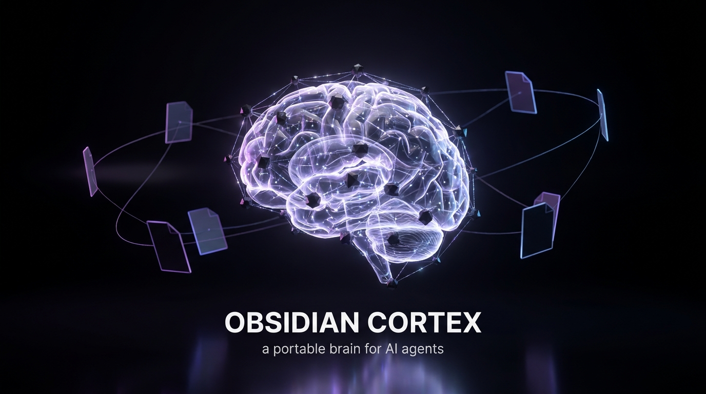
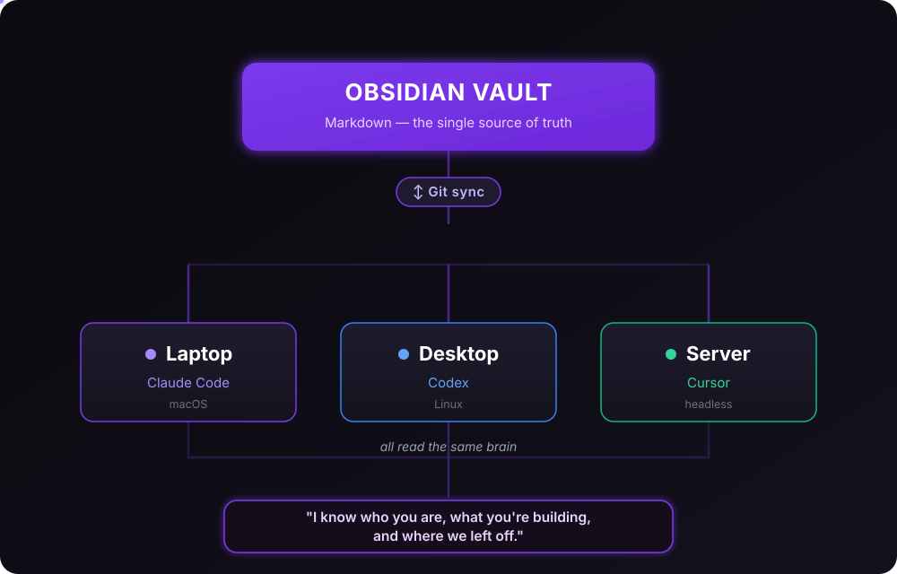

<!-- HERO -->
<p align="center">
  
</p>

<h1 align="center">🪨 Obsidian Cortex</h1>

<p align="center">
  <strong>A portable, file-based long-term memory system for AI coding agents — synced across every machine you work on.</strong>
</p>

<p align="center">
  <a href="#-quick-start"></a>
  
  
  <a href="LICENSE"></a>
</p>

<p align="center">
  
  
  
  
</p>

<p align="center">
  <em>No embeddings. No vector DB. No daemons. No lock-in.<br/>
  Just Markdown&nbsp;+&nbsp;Git&nbsp;+&nbsp;one zero-dependency script.</em>
</p>

---

## 💀 The problem

> Your AI agent wakes up with **amnesia** every single session.

You re-explain your stack. Your preferences. What you were doing yesterday. What that cursed build flag does. *Every. Single. Time.* And if you bounce between a laptop, a desktop, and a server? The context never follows you.

## 🧠 The fix

**Obsidian Cortex** gives your agents a persistent, shared brain that lives in plain Markdown, syncs over Git, and follows you to every machine.

<p align="center">
  
</p>

<p align="center"><em>Any agent. Any machine. Reads a few files on startup → instantly up to speed.</em></p>

---

## ✨ Why it's different

<table>
<tr>
<td width="50%" valign="top">

### 🪨 Obsidian Cortex
- ✅ Plain Markdown — readable by you *and* every AI tool
- ✅ Git is the entire sync engine
- ✅ Zero dependencies, zero servers
- ✅ Works in Obsidian's graph + backlinks for free
- ✅ Live cross-machine, multi-session "who's doing what"
- ✅ Secrets-by-design kept *out*

</td>
<td width="50%" valign="top">

### 🗄️ Typical "AI memory" stacks
- ❌ Opaque vector DB you can't read
- ❌ A server / API to run and pay for
- ❌ Embeddings pipeline to maintain
- ❌ Lock-in to one tool's format
- ❌ No human-editable layer
- ❌ Single-machine by default

</td>
</tr>
</table>

---

## ⚡ Quick start — *let the agent set itself up*

> **Requirements:** [Obsidian](https://obsidian.md) + [Obsidian Git plugin](https://github.com/Vinzent03/obsidian-git) (for real-time multi-machine sync) · Git · Node 18+

Don't run setup by hand. Clone the vault, open your AI agent **inside it**, and hand it the goal:

```bash
git clone https://github.com/YOUR-USERNAME/obsidian-cortex.git Obsidian-Vault
cd Obsidian-Vault
claude        # or: codex
```

> 🔒 **Make your copy private.** Your vault will hold your projects, decisions, and machine notes.
> Create a **private** repo (GitHub → *New repository* → Private), then point this clone at it:
> `git remote set-url origin git@github.com:YOU/your-private-brain.git && git push -u origin main`.
> Pull framework updates later with `git pull https://github.com/YOUR-USERNAME/obsidian-cortex.git main`.

Then paste:

> **Onboard this machine to the Obsidian Cortex brain.** Read `START-HERE.md` and do every step:
> pick a machine name from this computer's hostname, register it, install the skills + sync hook,
> then commit and push. Confirm each step and tell me the machine name you chose.

The agent reads [`START-HERE.md`](START-HERE.md) and does the whole setup — clone-to-configured in one prompt. **That's the point of the whole project: you give the goal, the agent does the work.**

<details>
<summary>Prefer to run it yourself? Manual setup →</summary>

```bash
node "AI Brain/scripts/brain.mjs" init-machine "Laptop"        # register this machine
node "AI Brain/scripts/brain.mjs" init-project "My Project"    # start a project
node "AI Brain/scripts/brain.mjs" install-claude-skills        # wire up Claude Code
node "AI Brain/scripts/brain.mjs" --help                       # everything else
```
Full step-by-step in [`START-HERE.md`](START-HERE.md).
</details>

---

## 🪄 You don't run CLI — *the agent does*

> **This is the whole point.** Typing `brain.mjs closeout ...` by hand is insane in the age of AI. Nobody will do it. So instead you type one short slash command (or paste a prompt), and the agent runs the real work.

Obsidian Cortex ships with **agent skills** wired as **slash commands** — the reliable way to drive the protocol. One word, and the agent does the bookkeeping:

| Command | When you run it | The agent automatically… |
|---|---|---|
| **`/brain-startup`** | start of a session | 🟢 pulls the vault, shows activity across machines, briefs you, marks this machine active |
| **`/brain-closeout`** | done / "push it" | 🏁 writes a session summary, updates project state, marks the machine idle |
| **`/brain-daily`** | end of day | 📅 rolls up the day's sessions into `Daily/` |
| **`/brain-bootstrap`** | new machine | 🤖 sets the machine up from scratch |
| **`/marathon`** | a long "don't stop until done" run | 🏃 keeps a resumable `tasks/marathon.md` tracker; a Stop hook keeps the agent going until every item is checked |
| **`/friction-audit`** | weekly / after a rough stretch | 🔍 mines your recent sessions for corrections, interrupts, and error loops, and proposes the skill, hook, or rule that fixes each one |

```text
You:   /brain-closeout
Agent: ✍️  Writing session summary to the brain…
       📦  Updated "My Project" → Current State + Next Steps
       😴  Marked Laptop idle
       🚀  Pushed. Tomorrow's session (any machine) picks up here.
```

Drop the included `.claude/skills/` into Claude Code (or the `AGENTS.md` block into Codex) and the commands light up.

> ⚠️ **Honest note:** Claude Code *can* auto-fire skills from natural phrases ("wrap up", "catch me up"), but that discovery is **probabilistic and often won't trigger**. The slash commands always fire — use them. Natural language is a nice-to-have, not the path.

<details>
<summary>🔧 The underlying commands (the slash commands call these for you)</summary>

```bash
node "AI Brain/scripts/brain.mjs" whoami        # resolve this machine's canonical name (hostname/aliases)
node "AI Brain/scripts/brain.mjs" startup "Laptop" --agent "Claude Code" --project "My Project" --focus "Refactoring auth"   # prints a session_id
node "AI Brain/scripts/brain.mjs" snapshot      # who's doing what across all machines (per session)
node "AI Brain/scripts/brain.mjs" closeout "My Project" "Auth refactor" "Laptop" --summary "..." --next "..."
node "AI Brain/scripts/brain.mjs" reap "Laptop" # clear ghost sessions after a crash (no heartbeat in 48h)
```
</details>

> Because the vault is Git-synced, your **desktop can literally see** that your **laptop** is mid-refactor on the auth layer. Cross-device continuity, zero servers. 🤯

---

## 🤖 Or don't even type the commands — *hooks run the brain for you*

Slash commands are reliable, but people forget them. Wire the included Claude Code hooks and the protocol runs itself:

| Hook | What happens, automatically |
|---|---|
| 🌅 **Session start** | Vault pulled, ghost sessions reaped, and a one-line digest injected: who's active on other machines, open loops, tracked projects. |
| 🔄 **Session start** | Any skill that changed in the vault is re-installed — edit once, every machine updates. |
| 🛑 **Stop** | Shipped a commit or PR but wrote no closeout? The agent is stopped **once** and told to run `/brain-closeout`. |
| 🧯 **Session end** | Real work but still no closeout? A git-derived safety-net note is written and pushed, so nothing is silently lost. |

All hooks are fail-open — they can never block or slow a session. Setup is one JSON snippet: [`AI Brain/scripts/hooks/README.md`](AI%20Brain/scripts/hooks/README.md).

<details>
<summary>🧩 More built-in workflow</summary>

- **Machine identity you can trust** — `whoami` resolves this machine from the stable `LocalHostName` + `Machines/aliases.json` and shouts on stderr if hostname and alias disagree, so one machine never writes into another's folder.
- **Pull before you write** — closeout rebases onto the latest vault before drafting, so machines editing the same project don't collide.
- **Honest closeouts** — every field is required; an omitted one is written as an explicit `Unknown — caller omitted …` marker, never a silent `TODO`.
- **Daily rollups that mean something** — `/brain-daily` extracts the day's decisions, open loops, and next steps from every session closeout.
- **Fleet Apply Queue** — a shared `Shared/Fleet Apply Queue.md` (template in `templates/shared/`) for learnings every machine should *apply*, not just read. Each machine marks when it has.
- **`Stop when:` on live work** — project state, open loops, and session notes carry an explicit done condition; agent handoffs point at the note instead of paraphrasing it.
- **Optional Jev gates** — with a [TypeSafe](https://docs.typesafe.ai) key, startup can confirm the project from abstracted folder names and closeout gets an advisory "was this worth a full note?" score. Off by default, fail-open, and nothing but abstracted signals ever leaves the machine. See [`typesafe-jev-gates.md`](AI%20Brain/docs/typesafe-jev-gates.md).

</details>

---

## 🗂️ What's inside

```text
AI Brain/
├── 🌐 Shared/            Cross-machine memory — who you are, prefs, decisions, open loops
├── 💻 Machines/          Per-computer state — each machine owns one folder
│   └── _Template Machine/
│       ├── Current Context.md   What an agent here should know before working
│       ├── Local Setup.md       Paths, tools, OS notes for this box
│       └── Session Log.md       Short index of meaningful sessions
├── 📦 Projects/          Per-project memory (overview · state · decisions · next steps)
├── 📅 Daily/             Auto-rolled daily summaries
├── 🤖 skills-claude-code/  Agent skills — brain-* protocol + marathon + friction-audit
├── 🧩 templates/         The blueprints brain.mjs stamps out (incl. Fleet Apply Queue)
├── 📖 docs/              Setup + workflow guides (Codex, Claude Code, Cursor, cron, Jev)
└── ⚙️  scripts/
    ├── brain.mjs         The whole engine — pure Node stdlib, zero deps
    ├── jev-gates.mjs     Optional TypeSafe gates (off unless you add a key) + tests
    └── hooks/            Claude Code hooks that run the protocol automatically

.claude/
├── skills/              Auto-installed skills for Claude Code
└── commands/            /brain-startup · /brain-closeout · /brain-daily slash commands
```

---

## 🔐 What to store (and what *never* to)

<table>
<tr>
<td width="50%" valign="top">

**✅ Store this**
- Profile, preferences, working style
- Active projects & priorities
- Decisions and *why*
- Current state & next steps
- Per-machine setup notes
- Short session summaries

</td>
<td width="50%" valign="top">

**🚫 Never store this**
- Secrets, API keys, tokens, passwords
- Cookies, credentials, recovery codes
- Full chat transcripts
- Giant generated logs
- Sensitive personal data

</td>
</tr>
</table>

> `brain.mjs` is built around this rule and reminds agents of it. A `.gitignore` guards common secret files too. **Keep your vault in a private repo** and still treat it as if it could leak — you're responsible for what you commit.
>
> The `.gitignore` in *this* template also blocks live brain state (`Machines/*`, `Projects/*`, `Shared/*`, `Daily/*`, …) so nothing personal lands in the public framework by accident. In **your private copy**, delete that last block so your memory actually syncs.

---

## 🧭 Design principles

| Principle | What it means |
|---|---|
| **Plain text wins** | If a tool can read a file, it can read your brain. |
| **Boring sync** | Git is the whole sync layer. No custom servers, ever. |
| **Zero dependencies** | `brain.mjs` is pure Node stdlib. Nothing to install. |
| **Human-first** | Everything is legible and editable by you in Obsidian. |
| **Secrets stay out** | The system is designed to be safe to sync and share. |

---

## 🛠️ Multi-machine sync

Each machine clones the same vault repo. Agents `git pull` on session start and `git push` on closeout — but for **real-time** background sync (so your desktop sees your laptop's changes seconds later, without an agent running), use the Obsidian Git plugin.

### 🔌 Required for multi-machine: the Obsidian Git plugin

> **[Obsidian Git](https://github.com/Vinzent03/obsidian-git)** (by Vinzent03) is what makes the vault sync across machines in real time. Install it on every machine.

1. In Obsidian: **Settings → Community plugins → Browse → search "Git"** → install **Obsidian Git** → Enable.
2. Configure it to **auto-pull on startup** and **auto-commit-and-push** on an interval (e.g. every 5–10 min).
3. Now edits on any machine propagate to all the others automatically — no manual `git` needed.

Without it, you'd be manually pulling/pushing (or relying on the agent to do it each session). With it, the brain is genuinely *live* across every device.

For agents working headless (no Obsidian GUI), the manual pull still works:
```bash
cd ~/Obsidian-Vault && git pull --rebase --autostash --quiet
```

Full wiring guides for **Codex**, **Claude Code**, and **cron** live in [`AI Brain/docs/`](AI%20Brain/docs/), plus [`HOW-IT-WORKS.md`](HOW-IT-WORKS.md) for the full mental model and [`AGENT-BOOTSTRAP.md`](AGENT-BOOTSTRAP.md) for agent-driven new-machine setup.

---

## 🤝 Contributing

Issues and PRs welcome — especially **adapters for new AI tools**, better setup docs, and workflow improvements. This is a reference implementation meant to be forked and made your own.

## 📄 License

**MIT** — see [LICENSE](LICENSE). Build your second brain however you like.

---

<p align="center">
  <sub>Inspired by the "second brain" &amp; Zettelkasten philosophy — rebuilt for the age of AI agents.</sub><br/>
  <sub>If this gave your agents a memory, drop a ⭐ — it helps others find it.</sub>
</p>
